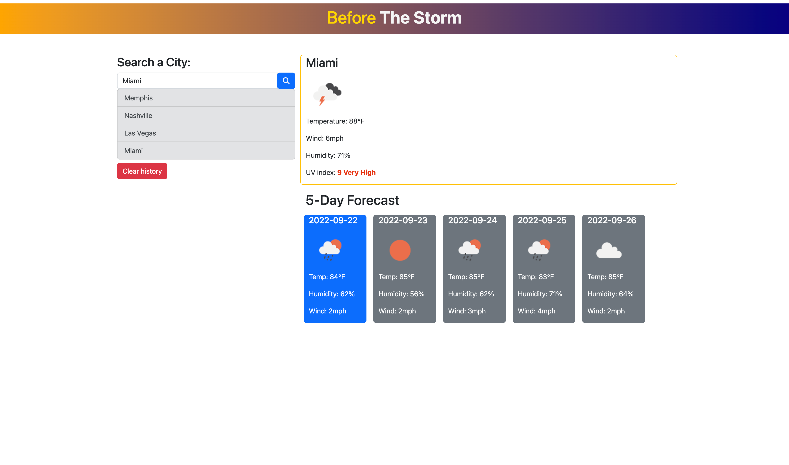

# Before-The-Storm

A website that tracks the weather, it will give you your active/present forecast which includes temperture in °F, wind speed, humidity, an icon for visual representation, UV index that's been color formated to repesent the real Uv index and a future 5 day forecast with similar features for the next 5 days This project is carried by Jscript, Bootstrap, jQuery and some CSS. (Currently working on local storage to be clickable)

## Screenshot

## URL for live

[Link to active page!](https://jblay10.github.io/Before-The-Storm/)